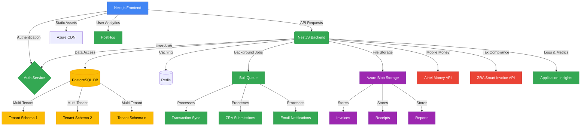

## MVP Flow

A clear, step-by-step description of the core minimum-viable process:

1. User registers with email/password and completes business onboarding wizard (name, ZRA TIN, profile)  

2. User securely links their business Airtel Mobile Money account(s) with appropriate authentication  

3. System automatically imports Airtel Mobile Money transaction history  

4. User views and categorizes transactions (linking income to invoices, payments to expenses)  

5. User creates professional sales invoices with automatic VAT calculation based on ZRA rules  

6. System sends invoices to customers via email as PDF  

7. User records business expenses, categorizes them against Zambian Chart of Accounts, and attaches receipts  

8. System prepares and submits sales invoice data to ZRA Smart Invoice API in real-time  

9. User views dashboard summarizing income, expenses, and mobile money balances  

10. User generates basic reports (Profit & Loss, VAT summary)  

---

## Launch Features (MVP)

### User Authentication & Onboarding

2–3-sentence summary: Secure user registration and business profile setup system that creates the foundation for multi-tenant architecture. Establishes business identity within the platform and collects essential information needed for financial operations and compliance.

* Email/password authentication with secure password policies  

* Business profile creation (name, ZRA TIN, business type, contact details)  

* Role-based access control for owner and staff accounts  

* Organization creation with multi-tenant isolation  

#### Tech Involved

* Next.js (React) with TypeScript for frontend  

* NestJS authentication modules with JWT  

* PostgreSQL with Prisma ORM (schema-per-tenant)  

* Azure Key Vault for credential management  

#### Main Requirements

* Secure authentication flow with email verification  

* Intuitive onboarding wizard optimized for non-technical users  

* Proper tenant isolation in database architecture  

* Compliance with Zambian Data Protection Act requirements  

### Airtel Mobile Money Integration

2–3-sentence summary: Seamless connection to Airtel Mobile Money accounts that automatically imports transaction history and enables real-time balance monitoring. Provides the foundation for financial reconciliation by bringing mobile money data into the financial management ecosystem.

* Secure OAuth or API key-based connection to Airtel Money accounts  

* Automated transaction history import with configurable date ranges  

* Real-time balance monitoring and transaction notifications  

* Transaction categorization and reconciliation tools  

#### Tech Involved

* Airtel Mobile Money API integration  

* Bull/BullMQ for background transaction syncing  

* Redis for caching transaction data  

* NestJS API modules for secure credential management  

#### Main Requirements

* Secure credential storage with encryption  

* Resilient error handling for API downtime  

* Efficient background syncing with retry mechanisms  

* User-friendly transaction categorization interface  

### Invoice Management

2–3-sentence summary: Comprehensive invoice creation and management system that automates VAT calculations based on ZRA rules. Enables professional invoice generation, delivery to customers, and seamless submission to ZRA Smart Invoice system.

* Professional invoice creation with line items and VAT calculation  

* Customer management database  

* PDF generation and email delivery  

* ZRA Smart Invoice API integration for real-time submission  

* Invoice status tracking (draft, sent, paid, submitted to ZRA)  

#### Tech Involved

* PDF generation library  

* Email delivery service  

* ZRA Smart Invoice API integration  

* Azure Blob Storage for invoice archiving  

#### Main Requirements

* Compliance with ZRA invoice format requirements  

* Real-time or queued submission to ZRA Smart Invoice API  

* Robust error handling for failed submissions  

* Audit trail of all invoice activities  

### Expense Management

2–3-sentence summary: Digital expense recording system that categorizes business expenses according to Zambian Chart of Accounts. Enables receipt attachment and provides the foundation for financial reporting and tax compliance.

* Expense entry with amount, date, category, and description  

* Zambian Chart of Accounts integration for proper categorization  

* Digital receipt attachment and storage  

* Expense approval workflows (optional for MVP)  

#### Tech Involved

* Azure Blob Storage for receipt storage  

* Image optimization libraries  

* PostgreSQL for transactional data  

#### Main Requirements

* Mobile-friendly receipt upload interface  

* Proper expense categorization aligned with Zambian accounting standards  

* Secure and compliant receipt storage  

* Basic expense reporting capabilities  

### Financial Dashboard & Reporting

2–3-sentence summary: Intuitive dashboard that provides real-time visibility into business financial health with key metrics and visualizations. Enables basic financial reporting including Profit & Loss statements and VAT summaries essential for business decision-making.

* Overview dashboard with key financial metrics  

* Mobile money account balance display  

* Income vs. expenses visualization  

* Basic report generation (Profit & Loss, VAT summary)  

* Export capabilities (PDF, Excel)  

#### Tech Involved

* React data visualization libraries  

* Report generation services  

* Excel/PDF export libraries  

#### Main Requirements

* Responsive design for mobile and desktop access  

* Performance optimization for low-bandwidth conditions  

* Clear data visualization with minimal complexity  

* Essential reports needed for Zambian business compliance  

---

## Future Features (Post-MVP)

### Additional Mobile Money Integrations

* Integration with MTN Mobile Money for transaction import and reconciliation  

* Integration with Zamtel Money and other local payment providers  

* Unified dashboard view across all mobile money platforms  

* Automated cross-platform reconciliation  

#### Tech Involved

* Additional mobile money provider APIs  

* Abstraction layer for unified payment provider interface  

* Enhanced reconciliation algorithms  

#### Main Requirements

* Consistent user experience across different payment providers  

* Unified transaction categorization system  

* Scalable architecture to easily add new providers  

* Performance optimization for multiple concurrent API connections  

### Advanced Financial Analytics

* Cash flow forecasting with AI-powered predictions  

* Business performance benchmarking against industry standards  

* Anomaly detection for unusual financial patterns  

* Customizable financial reports and dashboards  

#### Tech Involved

* Azure Machine Learning or similar AI services  

* Data warehousing solution for analytics  

* Advanced visualization libraries  

* ETL pipelines for data preparation  

#### Main Requirements

* Accurate prediction models trained on Zambian business data  

* Intuitive visualization of complex financial metrics  

* Secure handling of aggregated financial data  

* Offline capability for critical reports  

### Inventory Management

* Product and service catalog management  

* Stock level tracking and low-stock alerts  

* Purchase order creation and supplier management  

* Inventory valuation and cost of goods sold calculation  

#### Tech Involved

* Barcode/QR code scanning capabilities  

* Real-time inventory database  

* Supplier management system  

* Inventory reporting engine  

#### Main Requirements

* Mobile-friendly inventory counting interface  

* Integration with invoice system for automatic stock adjustments  

* Zambian-specific inventory valuation methods  

* Multi-location inventory support  

### Payroll & HR Management

* Employee database and contract management  

* Salary calculation with Zambian tax compliance  

* NAPSA (National Pension Scheme Authority) contribution automation  

* Leave management and attendance tracking  

#### Tech Involved

* Zambian tax calculation engine  

* NAPSA API integration (if available)  

* Secure employee data storage  

* Payslip generation system  

#### Main Requirements

* Compliance with Zambian labor laws and tax regulations  

* Secure handling of sensitive employee information  

* Automated statutory deductions and contributions  

* Digital payslip delivery  

### Banking Integration & Reconciliation

* Direct bank account connections for transaction import  

* Automated bank reconciliation with mobile money transactions  

* Check/cheque printing and management  

* Loan and credit facility tracking  

#### Tech Involved

* Bank API integrations (where available)  

* Open Banking standards implementation  

* PDF statement parsing for banks without APIs  

* Reconciliation matching algorithms  

#### Main Requirements

* Secure banking credential management  

* Efficient reconciliation of transactions across platforms  

* Support for manual statement upload where APIs unavailable  

* Comprehensive audit trails for all banking activities  

---

## System Diagram

---

## Questions & Clarifications

* How will users authenticate with Airtel Mobile Money API? Will this require user intervention (e.g., OTP verification) or can it be fully automated with API keys?  
  * This will almost certainly require user intervention. For financial accounts, direct API key integration without explicit user consent and potentially multi-factor authentication (like OTP or in-app approval) is highly unlikely due to security and regulatory requirements.
  * Expect an OAuth 2.0 flow or similar secure delegated authorization mechanism where the user initiates the link, authenticates directly with Airtel (via a redirect to an Airtel portal or an OTP sent to their mobile number), and then grants IntelliFin specific permissions.
  * Full automation with only API keys is generally not permitted for direct access to user financial transaction data.
  * Action: Conduct thorough research on Airtel Mobile Money's specific developer API documentation for account linking and transaction fetching to understand the exact authentication flow and security constraints.

* Based on the ZRA VSDC API Specification document, we now understand that ZRA Smart Invoice integration requires:
  * Initial device registration and initialization through the Smart Invoice Taxpayer Portal
  * API keys are generated during device initialization and stored locally by the VSDC
  * Authentication uses these API keys for all subsequent requests
  * The VSDC acts as a bridge between our system and ZRA Smart Invoice

* The ZRA Smart Invoice API requires the following specific data fields for sales invoice submission:
  * Taxpayer identification (TPIN, Branch ID)
  * Invoice details (invoice number, date, time, type)
  * Customer information (name, address, TPIN if applicable)
  * Item details (item code, name, quantity, unit price, tax information)
  * Payment information (payment type, amount)
  * VAT and other tax calculations must follow specific Zambian tax rules
  * All codes (tax types, product types, units of measure) must use ZRA standard codes

* The ZRA Smart Invoice integration process follows these steps:
  1. Register for VSDC service through Smart Invoice Taxpayer Portal
  2. Download and deploy VSDC as WAR/JAR file on local server
  3. Initialize device to obtain API keys
  4. Retrieve and store standard codes and classification codes
  5. Register items/products in Smart Invoice
  6. Submit sales transactions in real-time or near real-time

* Are there specific Zambian accounting standards or Chart of Accounts structure that must be adhered to for proper financial reporting?  
  * Yes, Zambia has likely adopted international accounting standards (like IFRS for SMEs) or has its own local GAAP (Generally Accepted Accounting Principles) that influence how financial statements are prepared.
  * A standard Chart of Accounts (CoA) structure specific to Zambian business types or tax regulations is highly probable.
  * Action: Consult with a Zambian accountant or financial compliance expert to identify the relevant accounting standards and a recommended Chart of Accounts structure for Zambian SMEs to inform the database design for categorization and reporting.

* What are the expected transaction volumes for typical SME users? This impacts database design and API rate limit planning.  
  * For SMEs (1-50 employees), volumes could range from a few transactions per day (very small businesses) to hundreds or even thousands (busier SMEs).
  * Low (< 50/day): Basic PostgreSQL setup with schema-per-tenant and standard indexing will likely suffice.
  * Medium (50-500/day): Optimizations like proper indexing, efficient queries, and careful connection pooling become more critical.
  * High (> 500/day): Might necessitate database sharding strategies within the schema-per-tenant model, or exploring partitioning.
  * Action: Conduct interviews with a sample of target Zambian SMEs to get a realistic estimate of their daily/monthly transaction volumes for mobile money and invoicing to inform scaling decisions and API consumption strategies.

* Are there specific data residency requirements under the Zambian Data Protection Act that would necessitate hosting in specific regions?  
  * For financial and sensitive personal data, many countries have strict data residency laws, often requiring data to be stored within national borders or specific approved regions.
  * Action: Thoroughly review the Zambian Data Protection Act (No. 3 of 2021) and any relevant subsidiary legislation or guidance from the Zambian Data Protection Authority.
  * If specific in-country residency is mandated, then hosting exclusively in a Zambian Azure region (if available and suitable) or the closest compliant African region (e.g., South Africa) is essential.
  * Legal counsel should confirm compliance requirements.

* What level of offline functionality is required given potential connectivity challenges in certain areas of Zambia? The ZRA VSDC API appears to require online connectivity for real-time transaction submission.  
  * For financial applications in regions with intermittent connectivity, consider these offline capability levels:
  * Minimal: Allow users to view cached data (dashboard, past transactions/invoices) but require connectivity for any data entry or submission.
  * Moderate: Allow users to create invoices and record expenses offline, queuing these actions for synchronization once connectivity is restored. This would require local data storage (e.g., IndexedDB in the browser) and robust conflict resolution mechanisms.
  * High: Allow full offline operations for core tasks, syncing large data sets and handling complex reconciliation logic locally. This increases complexity significantly.
  * Action: For MVP, focus on viewing cached data and potentially queuing simple operations like expense recording. Complex offline reconciliation should be considered a post-MVP feature.

* How will the system handle foreign currency transactions, if applicable to Zambian SMEs?  
  * If foreign currency transactions are relevant (e.g., importing goods, international sales), the system needs:
  * Currency field: A field to specify the currency for each transaction/invoice.
  * Exchange rates: A mechanism to store and apply historical exchange rates for reporting (e.g., converting to ZMW for P&L). Integration with an exchange rate API might be needed.
  * Multi-currency accounts: If SMEs hold accounts in different currencies, the system needs to track balances per currency.
  * Action: Confirm with Zambian SMEs if foreign currency transactions are a significant pain point for the MVP. If so, plan for basic multi-currency recording and reporting, allowing for future expansion.

* What are the specific security audit requirements for financial applications in the Zambian regulatory context?  
  * Financial applications typically face stringent audit requirements beyond general data protection, including:
  * Forensic audit trails: Immutable logs of all significant financial transactions, user actions (creation, modification, deletion), and system events.
  * Access control audits: Regular reviews of user permissions and access logs.
  * Penetration testing & vulnerability assessments: Mandatory periodic security testing.
  * Compliance with frameworks: Potentially adherence to standards like ISO 27001.
  * Action: Consult with legal and compliance experts in Zambia to understand specific financial sector security regulations and audit expectations. Build comprehensive, tamper-proof audit logging into the application from day one.

---

## Architecture Consideration Questions

* How should we balance the schema-per-tenant PostgreSQL approach with connection pooling to ensure database scalability as tenant count grows?  
  * Use a server-side connection pooler like PgBouncer or a cloud-managed equivalent (e.g., Azure Database for PostgreSQL's built-in connection pooling).
  * Prisma typically uses a connection per client. Without pooling, each tenant connecting would open a dedicated connection, quickly overwhelming the database.
  * A pooler manages a shared pool of connections, reducing overhead and improving performance for a large number of concurrent clients/tenants.
  * Implementation: Configure NestJS to connect through the pooler. The pooler will manage the individual database connections to PostgreSQL, allowing efficient reuse and preventing resource exhaustion.

* Based on the ZRA VSDC API Specification, what's the optimal strategy for handling ZRA Smart Invoice API failures or downtime? The system should:
  * Implement robust asynchronous processing with a dead-letter queue (DLQ) and a circuit breaker pattern:
    * Asynchronous Processing: Use Bull/BullMQ for all ZRA submissions. Jobs are added to a queue, processed by workers in the background, and can be retried automatically.
    * Retry Mechanism: Configure exponential backoff with a maximum number of retries for transient failures.
    * Dead-Letter Queue (DLQ): If retries are exhausted, move the failed submission to a DLQ. This prevents poison messages from blocking the main queue and allows for manual inspection and re-processing.
    * Circuit Breaker: Implement a circuit breaker around the ZRA API calls. If too many consecutive failures occur, the circuit "trips," preventing further calls to the API for a defined period.
    * User Feedback & Notifications: Inform users immediately about submission failures and provide clear instructions for resolution or re-submission.

* Should we implement a Command Query Responsibility Segregation (CQRS) pattern to separate transaction processing from reporting queries?  
  * For an MVP, no, not initially. CQRS adds significant architectural complexity (event stores, separate read/write models, data synchronization).
  * Start with a simpler, monolithic read/write model. If, and only if, you encounter significant performance bottlenecks where read queries (especially complex reports) negatively impact write operations, then consider introducing CQRS for specific, high-contention areas.
  * It's an optimization for scale, not a day-one necessity for an MVP, especially with a schema-per-tenant relational database.

* How can we design the mobile money integration layer to be provider-agnostic for easier addition of new providers post-MVP?  
  * Implement an abstraction layer or a provider interface pattern:
    * Define a common interface or set of contracts for all mobile money operations (e.g., fetchTransactions(accountId, dateRange), getAccountBalance(accountId)).
    * Create a MobileMoneyService interface or abstract class.
    * Develop specific implementations for each provider (e.g., AirtelMobileMoneyService, MTNMobileMoneyService).
    * Use a factory or dependency injection to provide the correct implementation based on the linked account type.
    * Standardize the data model for transactions and balances within IntelliFin, so external data is mapped to this internal model upon import.
  * This minimizes changes to core business logic when adding new providers, requiring only a new implementation of the interface.

* What caching strategy will provide the best performance for financial dashboards while ensuring data accuracy?  
  * Use a combination of read-through/write-through caching for frequently accessed, less volatile data and time-based invalidation for summary data:
    * Redis for hot data: Cache frequently accessed summary data (e.g., daily income/expense totals for the dashboard, mobile money balances) in Redis.
    * Cache Invalidation:
      * Event-driven invalidation: When a transaction is categorized, an invoice is created/submitted, or an expense is recorded, invalidate relevant cache keys.
      * Time-to-Live (TTL): For data that can tolerate slight staleness (e.g., dashboard balances), set a short TTL (e.g., 5-15 minutes) in Redis. Background jobs can refresh this data proactively.
    * Materialized Views (PostgreSQL): For complex reports, consider PostgreSQL materialized views. These are pre-computed result sets that can be refreshed periodically (e.g., hourly for monthly reports) by a BullMQ job, significantly speeding up query times for reporting dashboards.

* How should we approach data migration and schema updates across multiple tenant schemas when using Prisma ORM?  
  * This is a complex challenge with schema-per-tenant. A common approach involves automated schema migrations per tenant controlled by a central orchestrator:
    * Prisma Migrate: Use Prisma Migrate for schema evolution.
    * Orchestration Script: Develop a custom script or service that iterates through all active tenant schemas. For each tenant, it dynamically sets the schema property in the Prisma client and then executes the necessary npx prisma migrate deploy command.
    * Zero-Downtime: Plan for phased rollouts or blue/green deployments where possible to minimize downtime during migrations.
    * Rollback Strategy: Ensure a robust rollback strategy is in place for failed migrations, potentially involving database snapshots before critical updates.
    * Tooling: Consider custom tools or libraries built for multi-tenant Prisma migrations if the built-in ones aren't sufficient.

* What's the most efficient approach for handling file storage (receipts, invoices) considering bandwidth limitations and compliance requirements?  
  * Leverage Azure Blob Storage with optimized upload/download workflows and regional considerations:
    * Client-Side Uploads (Direct-to-Blob): Instead of proxying files through your NestJS backend, generate a time-limited Shared Access Signature (SAS) token on the backend and allow the Next.js frontend to upload directly to Azure Blob Storage.
    * Image Optimization: Implement image compression and serve optimized thumbnails or smaller versions for previews to reduce bandwidth usage during viewing.
    * Content Delivery Network (CDN): Use Azure CDN for serving static assets and generated PDFs/receipts. This caches content closer to users, improving download speeds and reducing load on your origin.
    * Data Residency: Ensure the Azure Blob Storage account is provisioned in the Azure region that complies with Zambian Data Protection Act residency requirements.
    * Security: Implement robust access control on blobs, encrypt data at rest, and use HTTPS for all transfers.

* Should we implement event sourcing for critical financial transactions to ensure complete audit trails and data integrity? This would be particularly valuable for ZRA Smart Invoice submissions to maintain records of all submission attempts and responses.  
  * For an MVP, no, not full event sourcing. Event sourcing is a very advanced pattern that introduces significant complexity.
  * Alternative (for MVP): Focus on a traditional transactional model with robust audit logging:
    * Database Audit Trails: Implement detailed audit trails directly in your PostgreSQL database (e.g., using triggers, a separate audit table, or a library that logs changes).
    * Immutable Records: Design critical financial transaction tables (e.g., ledger entries) to be largely immutable, focusing on appending new records rather than updating existing ones where possible.
    * Application-Level Logging: Supplement database trails with application-level logging for business-critical events using a structured logging solution (e.g., Azure Application Insights).
  * While event sourcing provides an ultimate audit trail, the complexity overhead for an MVP is too high. A well-designed relational database with explicit audit logging and application-level event logging can meet audit requirements for the initial phases.

* How can we design the system to support future AI/ML features without requiring significant architectural changes?  
  * Focus on clean data capture, robust data warehousing foundations, and modular service design:
    * Structured Data: Ensure all financial and operational data is captured in a highly structured and consistent manner within PostgreSQL.
    * Data Warehouse Readiness: Design with future ETL processes in mind, ensuring primary data models can be easily transformed into analytics-friendly schemas.
    * Feature Flags: Implement a feature flag system that allows for gradual rollout of AI/ML capabilities to specific tenants or user segments.
    * Modular Architecture: Design the system with clear service boundaries that would allow AI/ML components to be added as separate microservices that consume data from the core system.

* What monitoring and observability tools are most appropriate for ensuring system reliability while providing insights into application performance? Special attention should be given to monitoring ZRA Smart Invoice API integration points.  
  * Implement a comprehensive monitoring strategy using:
    * Azure Application Insights: For application performance monitoring (APM), error tracking, request tracing, and dependency monitoring (e.g., database queries, external API calls).
    * Azure Monitor & Log Analytics: For collecting metrics and logs from all Azure resources (VMs, databases, queues, storage). Set up alerts for critical thresholds (CPU, memory, disk I/O, queue depth).
    * PostHog: As already chosen, it's ideal for product analytics and user behavior insights.
    * Structured Logging: Ensure your NestJS application logs in a structured format (e.g., JSON) that can be easily ingested and queried by Azure Log Analytics.
    * Health Endpoints: Implement /health and /metrics endpoints in your NestJS application for uptime monitoring and custom metrics exposure.
